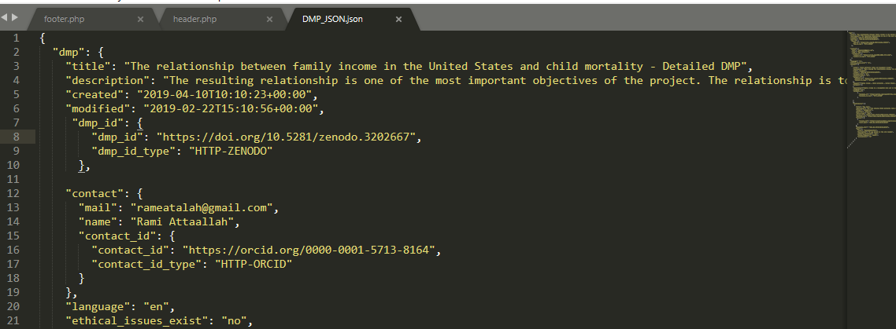

# Data-Stewardship-Exercise 2 
## Introduction
describe how the interaction of a researcher with a repository can be simplified with maDMP.
## Converting dmp into madmp
first step is making the regular DMP "that its format is pdf file" understandable by the computer and it done by converting it manually from pdf to a json object which is build with putting in regard RDA Common Standards "https://github.com/RDA-DMP-Common/RDA-DMP-Common-Standard".

## Developing json schema
after that we develop a json schema manually using RDA Common Standards so we can use it when validating the maDMP (json object) in the coming steps.
 ## Setting up the dataverse instance
 * Linux based operating system (Ubuntu)
 * sudo apt install openjdk-8-jdk
 * https://github.com/IQSS/dataverse-docker.git
 * sudo ./initial.bash.
 * sudo apt install docker.io
 * Install Docker-Compose  from here 
 * sudo docker-compose build
 * sudo docker-compose up
 * Now you can go to localhost:8085 and start your instance of dataverse
 ## Modifying the upload workflow
after that we start by creating the dataverse and the dataset we researcher to upload the maDMP alongside the uploaded file and before publishing the dataset we validate the maDMP with the json schema we created in previous steps and if it is validated correctly we add the metadata  and all of this steps done in the prePublishDataset workflow.
## Developing to allow exporting madmp 
the User browse the dataverse and finds the file to be exported 
 User clicks an additional button on a landing page to export information to maDMP
 then we get the metadata and then with using the json schema we can create a json object as madmp and then it downloaded to the user.
## contact
You can contact the author by email rameatalah@gmail.com and khaledmaher024@gmail.com.
